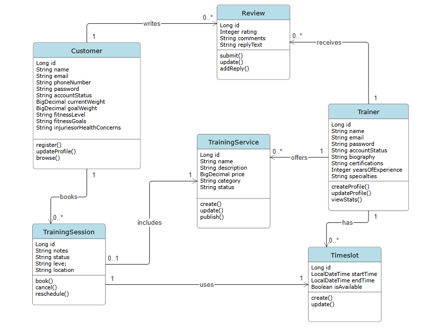

# FitMatch Backend API

**Version:** 1.0
**Last Updated:** July 5, 2026

**Base URL:**

- local: http://localhost:8080
- production: https://fit-match-pwsn.onrender.com
- mvc: https://fit-match-mvc.onrender.com

## Table of Contents

1. [Overview](#1-overview)
2. [UML Class Diagram](#2-uml-class-diagram)
3. [API Endpoints](#3-api-endpoints)
   - [Customer Endpoints](#31-customer-endpoints)
   - [Trainer Endpoints](#32-trainer-endpoints)
   - [Training Service Endpoints](#33-training-service-endpoints)
   - [Timeslot Endpoints](#34-timeslot-endpoints)
   - [Training Session Endpoints](#35-training-session-endpoints)
   - [Review Endpoints](#36-review-endpoints)
4. [Use Case Mapping](#4-use-case-mapping)

---

## 1. Overview

The FitMatch backend exposes a RESTful API for the fitness matching platform described in the SRS. It supports customer registration and profile management, trainer discovery, service catalog management, timeslot availability, basic training-session lookup, and review management.

---

## 2. UML Class Diagram



---

## 3. API Endpoints

### 3.1 Customer Endpoints

#### Create a customer

```http
POST /api/customers
```

Request body:

```json
{
  "name": "John Doe",
  "email": "johndoe@demo.com",
  "phoneNumber": "(555) 555-5555",
  "password": "password123",
  "accountStatus": "active",
  "currentWeight": 150,
  "goalWeight": 180,
  "fitnessLevel": "INTERMEDIATE",
  "fitnessGoals": "strength",
  "injuriesOrHealthConcerns": "none"
}
```

Example response:

```json
{
  "id": 1,
  "name": "John Doe",
  "email": "johndoe@demo.com",
  "phoneNumber": "(555) 555-5555",
  "password": "password123",
  "accountStatus": "active",
  "currentWeight": 150,
  "goalWeight": 180,
  "fitnessLevel": "INTERMEDIATE",
  "fitnessGoals": "strength",
  "injuriesOrHealthConcerns": "none",
  "reviews": [],
  "trainingSessions": []
}
```

#### Get all customers

```http
GET /api/customers
```

#### Get a customer by id

```http
GET /api/customers/{id}
```

#### Get a customer by email

```http
GET /api/customers/email/{email}
```

#### Update customer personal information

```http
PUT /api/customers/{id}/personal-info
```

Example request body:

```json
{
  "name": "Jane Doe",
  "email": "janedoe@demo.com",
  "phoneNumber": "(555) 555-5556"
}
```

#### Update customer fitness information

```http
PUT /api/customers/{id}/fitness-info
```

Example request body:

```json
{
  "currentWeight": 145,
  "goalWeight": 160,
  "fitnessLevel": "ADVANCED",
  "fitnessGoals": "strength, recovery",
  "injuriesOrHealthConcerns": "wrist sprain"
}
```

#### Delete a customer

```http
DELETE /api/customers/{id}
```

---

### 3.2 Trainer Endpoints

#### Create a trainer

```http
POST /api/trainers
```

Request body:

```json
{
  "name": "Alice Trainer",
  "email": "alice@demo.com",
  "password": "trainerpass",
  "accountStatus": "active",
  "biography": "Certified strength coach with a focus on mobility and recovery.",
  "certifications": "NASM, ACE",
  "yearsOfExperience": 8,
  "specialties": "strength training, mobility"
}
```

#### Get all trainers

```http
GET /api/trainers
```

#### Get a trainer by id

```http
GET /api/trainers/{id}
```

#### Get a trainer by email

```http
GET /api/trainers/email/{email}
```

#### Search trainers by specialty

```http
GET /api/trainers/specialty?query=strength+training
```

Example response:

```json
[
  {
    "id": 1,
    "name": "Alice Trainer",
    "email": "alice@demo.com",
    "accountStatus": "active",
    "biography": "Certified strength coach with a focus on mobility and recovery.",
    "certifications": "NASM, ACE",
    "yearsOfExperience": 8,
    "specialties": "strength training, mobility",
    "trainingServices": [],
    "timeslots": []
  },
  {
    "id": 2,
    "name": "Bob Coach",
    "email": "bob@demo.com",
    "accountStatus": "active",
    "biography": "Experienced personal trainer with a focus on functional fitness.",
    "certifications": "NASM, ACE",
    "yearsOfExperience": 10,
    "specialties": "functional fitness, weight loss",
    "trainingServices": [],
    "timeslots": []
  }
]
```

#### Update trainer personal information

```http
PUT /api/trainers/{id}
```

Example request body:

```json
{
  "name": "Alice Trainer Updated",
  "email": "alice@demo.com",
  "password": "newpassword"
}
```

#### Update trainer professional information

```http
PUT /api/trainers/{id}/professional
```

Example request body:

```json
{
  "biography": "Certified strength and conditioning coach.",
  "certifications": "NASM, ACE, CPR",
  "yearsOfExperience": 10,
  "specialties": "strength training, HIIT"
}
```

#### Delete a trainer

```http
DELETE /api/trainers/{id}
```

---

### 3.3 Training Service Endpoints

#### Create a training service

```http
POST /api/training-services
```

Request body:

```json
{
  "trainer": {
    "id": 1
  },
  "name": "Strength Foundations",
  "description": "A beginner-friendly strength program.",
  "price": 50.0,
  "category": "strength training",
  "status": "active"
}
```

#### Get all training services

```http
GET /api/training-services
```

#### Get a training service by id

```http
GET /api/training-services/{id}
```

#### Get services by trainer

```http
GET /api/training-services/trainer/{trainerId}
```

##### Search training services by name

```http
GET /api/training-services/search?query=Strength
```

#### Update a training service

```http
PUT /api/training-services/{id}
```

#### Delete a training service

```http
DELETE /api/training-services/{id}
```

---

### 3.4 Timeslot Endpoints

#### Create a timeslot

```http
POST /api/timeslots
```

Request body:

```json
{
  "trainer": {
    "id": 1
  },
  "startTime": "2026-07-10 09:00",
  "endTime": "2026-07-10 10:00",
  "isAvailable": true
}
```

#### Get timeslots for a trainer

```http
GET /api/timeslots/trainer/{trainerId}
```

#### Get one timeslot by id

```http
GET /api/timeslots/{id}
```

#### Get available timeslots for a trainer

```http
GET /api/timeslots/trainer/{trainerId}/available
```

Example response:

```json
[
  {
    "id": 10,
    "trainer": {
      "id": 1
    },
    "startTime": "2026-07-10 09:00",
    "endTime": "2026-07-10 10:00",
    "isAvailable": true
  }
]
```

---

### 3.5 Training Session Endpoints

#### Book a training session

```http
POST /api/training-sessions
```

Request body:

```json
{
  "customer": {
    "id": 1
  },
  "trainingService": {
    "id": 2
  },
  "timeslot": {
    "id": 10
  },
  "notes": "Focus on mobility and posture",
  "status": "Scheduled",
  "level": "Beginner",
  "location": "Downtown Studio"
}
```

#### Get training sessions for a customer

```http
GET /api/training-sessions/customer/{customerId}
```

Example response:

```json
[
  {
    "id": 3,
    "customer": {
      "id": 1
    },
    "trainingService": {
      "id": 2
    },
    "timeslot": {
      "id": 10
    },
    "notes": "Focus on mobility and posture",
    "status": "Scheduled",
    "level": "Beginner",
    "location": "Downtown Studio"
  }
]
```

---

### 3.6 Review Endpoints

#### Get reviews by customer

```http
GET /api/reviews/customer/{customerId}
```

#### Get reviews by trainer

```http
GET /api/reviews/trainer/{trainerId}
```

#### Create a review

```http
POST /api/reviews
```

Request body:

```json
{
  "customer": {
    "id": 1
  },
  "trainer": {
    "id": 2
  },
  "rating": 5,
  "comments": "Great coaching and clear instructions."
}
```

#### Update a review

```http
PUT /api/reviews/{id}
```

Request body:

```json
{
  "id": 1,
  "replyText": "Thank you for your feedback! Glad you enjoyed the session."
}
```

---

## 4. Use Case Mapping

The API endpoints support the following SRS user stories and acceptance flows described in the requirements document.

### Customer use cases

| SRS use case                          | Related Endpoints                                                                                         |
| ------------------------------------- | --------------------------------------------------------------------------------------------------------- |
| US-1 Register and manage profile      | `POST /api/customers`, `GET /api/customers/{id}`, `PUT /api/customers/{id}`, `DELETE /api/customers/{id}` |
| US-2 Browse trainers by goal category | `GET /api/trainers` , `GET /api/trainers/specialty?query={goal}`                                          |
| US-3 Book a training session          | `POST /api/training-sessions`                                                                             |
| US-4 Write a review after a session   | `POST /api/reviews`                                                                                       |

### Provider use cases

| SRS use case                           | Related Endpoints                                                                                      |
| -------------------------------------- | ------------------------------------------------------------------------------------------------------ |
| US-5 Create and update trainer profile | `POST /api/trainers`, `GET /api/trainers/{id}`, `PUT /api/trainers/{id}`, `DELETE /api/trainers/{id}`  |
| US-6 Define services and pricing       | `POST /api/training-services`, `PUT /api/training-services/{id}`, `DELETE /api/training-services/{id}` |
| US-7 Respond to reviews                | `PUT /api/reviews/{id}`                                                                                |
| US-8 View customer statistics          | `GET /api/trainers/{id}/statistics`                                                                    |
